# Workflows del Prompts-Maintainer - Sistema Retail Manager

## Flujos de Trabajo Automatizados

> **🎯 Objetivo**: Definir procesos sistemáticos para mantener documentación de prompts actualizada y consistente.

## 🔄 W1: Workflow Detección → Actualización

### Flujo Principal


### Implementación Detallada

#### Fase 1: Detección
```python
def detect_changes(changed_files, commit_message):
    """Analizar cambios y determinar si requieren actualización de prompts"""

    triggers = []

    for file_path in changed_files:
        # D1: Database Schema Changes
        if file_path.startswith('supabase/migrations/'):
            triggers.append({
                'type': 'database_schema',
                'priority': 'CRITICAL',
                'file': file_path,
                'auto_execute': True
            })

        # D2: Model Changes
        elif file_path.startswith('retail_manager/lib/models/'):
            triggers.append({
                'type': 'model_updated',
                'priority': 'HIGH',
                'file': file_path,
                'auto_execute': False  # Require review
            })

        # D3: Repository Changes
        elif file_path.startswith('retail_manager/lib/repositories/'):
            triggers.append({
                'type': 'repository_updated',
                'priority': 'HIGH',
                'file': file_path,
                'auto_execute': False
            })

    # D4: Error Resolution Detection
    if re.search(r'(fix|solved|resolved).*(error|bug|issue)', commit_message, re.I):
        triggers.append({
            'type': 'error_resolved',
            'priority': 'CRITICAL',
            'context': commit_message,
            'auto_execute': True
        })

    return triggers
```

#### Fase 2: Análisis de Impacto
```python
def analyze_impact(trigger):
    """Determinar qué documentos necesitan actualización"""

    impact_map = {
        'database_schema': {
            'primary': ['schemas/database-schema.md'],
            'secondary': ['modules/*-module.md'],
            'validation': ['cross_reference_check', 'schema_consistency']
        },

        'model_updated': {
            'primary': ['modules/{module}-module.md'],
            'secondary': ['schemas/api-contracts.md'],
            'validation': ['model_consistency', 'json_mapping']
        },

        'error_resolved': {
            'primary': ['patterns/error-patterns.md'],
            'secondary': ['modules/{related}-module.md'],
            'validation': ['error_categorization', 'solution_verification']
        }
    }

    return impact_map.get(trigger['type'], {})
```

#### Fase 3: Ejecución de Updates
```python
async def execute_update(trigger, impact):
    """Ejecutar actualización de documentos"""

    template = select_template(trigger['type'])
    context = extract_context(trigger)

    for doc in impact['primary']:
        try:
            result = await update_document(
                document=doc,
                template=template,
                context=context,
                mode='incremental'
            )

            log_update(doc, result.token_savings, result.execution_time)

        except UpdateError as e:
            log_error(doc, e)
            await rollback_changes(doc)
            raise

    # Validar consistencia después de updates
    validation_result = await validate_consistency(impact['validation'])

    if not validation_result.passed:
        await rollback_all_changes()
        raise ValidationError(validation_result.errors)

    return UpdateResult(success=True, documents_updated=len(impact['primary']))
```

## 🔍 W2: Workflow Validación Cruzada

### Proceso de Validación

```mermaid
graph TD
    A[Trigger Validación] --> B[Scan All Documents]
    B --> C[Extract Cross-References]
    C --> D[Validate Links]
    D --> E[Check Code Examples]
    E --> F[Verify Schema Consistency]
    F --> G{¿Errores Encontrados?}
    G -->|No| H[Generate Health Report]
    G -->|Sí| I[Categorize Issues]
    I --> J[Generate Fix Tasks]
    J --> K[Execute Fixes]
    K --> L[Re-validate]
    L --> M{¿Fixes OK?}
    M -->|Sí| H
    M -->|No| N[Escalate to Manual]
    H --> O[Archive Report]
    N --> P[Notify Admin]
```


### Implementación de Validaciones

#### V1: Link Validation
```python
def validate_cross_references():
    """Validar todos los enlaces entre documentos"""

    broken_links = []
    all_docs = glob.glob('prompts/**/*.md', recursive=True)

    for doc_path in all_docs:
        with open(doc_path, 'r', encoding='utf-8') as f:
            content = f.read()

        # Extraer links relativos
        links = re.findall(r'\[.*?\]\((.*?\.md.*?)\)', content)

        for link in links:
            # Resolver path relativo
            target_path = resolve_relative_path(doc_path, link)

            if not os.path.exists(target_path):
                broken_links.append({
                    'source': doc_path,
                    'target': link,
                    'resolved_path': target_path
                })

    return broken_links
```

#### V2: Code Example Validation
```python
def validate_code_examples():
    """Validar que ejemplos de código sean sintácticamente correctos"""

    invalid_examples = []

    # Buscar bloques de código en documentos
    code_blocks = extract_code_blocks('prompts/**/*.md')

    for block in code_blocks:
        if block['language'] in ['dart', 'sql', 'yaml']:
            try:
                validate_syntax(block['code'], block['language'])
            except SyntaxError as e:
                invalid_examples.append({
                    'file': block['file'],
                    'language': block['language'],
                    'error': str(e),
                    'line': block['line']
                })

    return invalid_examples
```

#### V3: Schema Consistency
```python
def validate_schema_consistency():
    """Verificar consistencia entre schema documentado y código"""

    inconsistencies = []

    # Extraer schema documentado
    documented_schema = parse_documented_schema('schemas/database-schema.md')

    # Extraer schema de migraciones
    actual_schema = parse_migrations_schema('supabase/migrations/')

    for table_name, doc_table in documented_schema.items():
        if table_name not in actual_schema:
            inconsistencies.append({
                'type': 'missing_table',
                'table': table_name,
                'issue': 'Table documented but not in migrations'
            })
            continue

        actual_table = actual_schema[table_name]

        # Comparar campos
        for field_name, doc_field in doc_table['fields'].items():
            if field_name not in actual_table['fields']:
                inconsistencies.append({
                    'type': 'missing_field',
                    'table': table_name,
                    'field': field_name,
                    'issue': 'Field documented but not in schema'
                })
            elif doc_field['type'] != actual_table['fields'][field_name]['type']:
                inconsistencies.append({
                    'type': 'type_mismatch',
                    'table': table_name,
                    'field': field_name,
                    'documented': doc_field['type'],
                    'actual': actual_table['fields'][field_name]['type']
                })

    return inconsistencies
```

## ⏰ W3: Workflow Programado (Batch Updates)

### Schedule Configuration
```yaml
# prompts/maintainer/schedule.yaml
batch_updates:
  daily:
    time: "02:00"
    timezone: "America/Lima"
    tasks:
      - "validate_consistency"
      - "process_pending_updates"
      - "generate_daily_report"

  weekly:
    time: "Sunday 03:00"
    timezone: "America/Lima"
    tasks:
      - "full_validation"
      - "optimize_documentation"
      - "cleanup_old_logs"
      - "generate_weekly_report"

  monthly:
    time: "1st 04:00"
    timezone: "America/Lima"
    tasks:
      - "architecture_review"
      - "performance_analysis"
      - "documentation_audit"
      - "generate_monthly_report"
```

### Implementación de Scheduler
```python
import schedule
import time
from datetime import datetime

class PromptsMaintainerScheduler:
    def __init__(self):
        self.setup_schedules()

    def setup_schedules(self):
        # Daily tasks
        schedule.every().day.at("02:00").do(self.daily_maintenance)

        # Weekly tasks
        schedule.every().sunday.at("03:00").do(self.weekly_maintenance)

        # Monthly tasks
        schedule.every().month.do(self.monthly_maintenance)

    async def daily_maintenance(self):
        """Tareas de mantenimiento diarias"""

        print(f"🌅 Starting daily maintenance - {datetime.now()}")

        try:
            # 1. Validar consistencia
            consistency_result = await validate_consistency()

            # 2. Procesar updates pendientes
            pending_updates = get_pending_updates()
            for update in pending_updates:
                if update['priority'] in ['HIGH', 'MEDIUM']:
                    await process_update(update)

            # 3. Generar reporte diario
            daily_report = generate_daily_report(consistency_result)
            save_report(daily_report, 'daily')

            print("✅ Daily maintenance completed successfully")

        except Exception as e:
            print(f"❌ Daily maintenance failed: {e}")
            notify_admin("Daily maintenance failure", str(e))

    async def weekly_maintenance(self):
        """Tareas de mantenimiento semanales"""

        print(f"📅 Starting weekly maintenance - {datetime.now()}")

        try:
            # 1. Validación completa
            full_validation_result = await full_validation()

            # 2. Optimizar documentación
            optimization_result = await optimize_documentation()

            # 3. Limpiar logs antiguos
            cleanup_old_logs(retention_days=30)

            # 4. Generar reporte semanal
            weekly_report = generate_weekly_report(
                full_validation_result,
                optimization_result
            )
            save_report(weekly_report, 'weekly')

            print("✅ Weekly maintenance completed successfully")

        except Exception as e:
            print(f"❌ Weekly maintenance failed: {e}")
            escalate_to_admin("Weekly maintenance failure", str(e))

    def run_forever(self):
        """Ejecutar scheduler continuamente"""
        print("🚀 Prompts Maintainer Scheduler started")

        while True:
            schedule.run_pending()
            time.sleep(60)  # Check every minute
```

## 🔧 W4: Workflow Optimización de Tokens

### Proceso de Optimización

```mermaid
graph TD
    A[Trigger Optimización] --> B[Analyze Current Docs]
    B --> C[Identify Redundancies]
    C --> D[Extract Common Patterns]
    D --> E[Create Reusable Templates]
    E --> F[Consolidate Information]
    F --> G[Apply Optimizations]
    G --> H[Measure Token Impact]
    H --> I{¿Target Achieved?}
    I -->|No| J[Refine Approach]
    I -->|Sí| K[Commit Optimized Docs]
    J --> D
    K --> L[Update Metrics]
```


### Implementación de Optimización
```python
class DocumentationOptimizer:
    def __init__(self, target_reduction=40):
        self.target_reduction = target_reduction
        self.optimization_techniques = [
            self.eliminate_redundancy,
            self.consolidate_examples,
            self.extract_common_templates,
            self.optimize_structure
        ]

    def optimize_documentation(self):
        """Ejecutar optimización completa de documentación"""

        baseline_tokens = self.count_total_tokens()
        print(f"📊 Baseline: {baseline_tokens:,} tokens")

        for technique in self.optimization_techniques:
            tokens_before = self.count_total_tokens()

            result = technique()

            tokens_after = self.count_total_tokens()
            savings = ((tokens_before - tokens_after) / tokens_before) * 100

            print(f"🔧 {technique.__name__}: {savings:.1f}% reduction")

        final_tokens = self.count_total_tokens()
        total_savings = ((baseline_tokens - final_tokens) / baseline_tokens) * 100

        print(f"✅ Total optimization: {total_savings:.1f}% reduction")

        if total_savings >= self.target_reduction:
            self.commit_optimizations()
            return True
        else:
            print(f"⚠️  Target {self.target_reduction}% not achieved")
            return False

    def eliminate_redundancy(self):
        """Eliminar información duplicada entre documentos"""

        redundancies = self.find_duplicate_content()

        for redundancy in redundancies:
            # Mantener en documento principal
            # Reemplazar con referencia en documentos secundarios
            self.replace_with_reference(
                redundancy['content'],
                redundancy['primary_doc'],
                redundancy['duplicate_docs']
            )

    def consolidate_examples(self):
        """Consolidar ejemplos similares en templates reutilizables"""

        similar_examples = self.find_similar_code_examples()

        for example_group in similar_examples:
            # Crear template genérico
            template = self.create_generic_template(example_group)

            # Reemplazar ejemplos específicos con template
            for example in example_group:
                self.replace_example_with_template(example, template)

    def extract_common_templates(self):
        """Extraer patrones comunes en templates reutilizables"""

        common_patterns = self.identify_common_patterns()

        for pattern in common_patterns:
            # Crear template reutilizable
            template_path = f"prompts/templates/{pattern['name']}.template.md"
            self.create_template(template_path, pattern)

            # Reemplazar ocurrencias con referencia al template
            self.replace_pattern_with_reference(pattern, template_path)
```

## 📊 W5: Workflow Reporting y Métricas

### Dashboard de Métricas
```python
class MetricsDashboard:
    def __init__(self):
        self.metrics_db = MetricsDatabase()

    def generate_daily_report(self):
        """Generar reporte diario de actividad"""

        today = datetime.now().date()

        metrics = {
            'updates_executed': self.count_updates(today),
            'documents_modified': self.count_modified_documents(today),
            'token_savings': self.calculate_token_savings(today),
            'errors_detected': self.count_errors(today),
            'consistency_score': self.calculate_consistency_score(),
            'pending_updates': self.count_pending_updates()
        }

        report = f"""
# Prompts Maintainer - Daily Report
**Date**: {today}

## 📊 Activity Summary
- **Updates executed**: {metrics['updates_executed']}
- **Documents modified**: {metrics['documents_modified']}
- **Token savings**: {metrics['token_savings']:.1f}%
- **Errors detected**: {metrics['errors_detected']}

## 🎯 Health Metrics
- **Consistency score**: {metrics['consistency_score']:.1f}%
- **Pending updates**: {metrics['pending_updates']}

## 📈 Trends
{self.generate_trend_charts(7)}  # Last 7 days

## 🚨 Alerts
{self.generate_alerts()}

## 📝 Recent Activity
{self.get_recent_activity(today)}
        """

        self.save_report(report, f"daily-{today}.md")
        return report

    def generate_weekly_report(self):
        """Generar reporte semanal de performance"""

        week_start = datetime.now().date() - timedelta(days=7)

        metrics = {
            'total_updates': self.count_updates_range(week_start, 7),
            'avg_update_time': self.avg_update_time_range(week_start, 7),
            'documentation_coverage': self.calculate_coverage(),
            'error_rate': self.calculate_error_rate_range(week_start, 7),
            'optimization_opportunities': self.identify_optimization_opportunities()
        }

        report = f"""
# Prompts Maintainer - Weekly Report
**Period**: {week_start} to {week_start + timedelta(days=7)}

## 📊 Performance Summary
- **Total updates**: {metrics['total_updates']}
- **Avg update time**: {metrics['avg_update_time']:.1f}s
- **Documentation coverage**: {metrics['documentation_coverage']:.1f}%
- **Error rate**: {metrics['error_rate']:.1f}%

## 🔧 Optimization Opportunities
{self.format_optimization_opportunities(metrics['optimization_opportunities'])}

## 📈 Performance Trends
{self.generate_performance_trends(30)}  # Last 30 days

## 🎯 Goals Progress
- Token optimization: {self.get_token_optimization_progress()}%
- Automation rate: {self.get_automation_rate()}%
- Documentation freshness: {self.get_freshness_score()}%

## 📝 Recommendations
{self.generate_recommendations(metrics)}
        """

        self.save_report(report, f"weekly-{week_start}.md")
        return report
```

### Alerting System
```python
class AlertingSystem:
    def __init__(self):
        self.alert_thresholds = {
            'error_rate': 10,  # % in last hour
            'pending_critical': 3,  # critical updates pending > 1 hour
            'consistency_score': 95,  # % minimum acceptable
            'token_usage_spike': 200  # % of normal usage
        }

    def check_alerts(self):
        """Verificar todas las condiciones de alerta"""

        alerts = []

        # Check error rate
        error_rate = self.get_error_rate_last_hour()
        if error_rate > self.alert_thresholds['error_rate']:
            alerts.append({
                'type': 'HIGH_ERROR_RATE',
                'severity': 'HIGH',
                'message': f"Error rate {error_rate}% exceeds threshold {self.alert_thresholds['error_rate']}%",
                'action': 'pause_auto_updates'
            })

        # Check pending critical updates
        pending_critical = self.count_pending_critical_updates()
        if pending_critical > self.alert_thresholds['pending_critical']:
            alerts.append({
                'type': 'PENDING_CRITICAL',
                'severity': 'CRITICAL',
                'message': f"{pending_critical} critical updates pending > 1 hour",
                'action': 'escalate_to_ux_ui'
            })

        # Check consistency score
        consistency_score = self.calculate_consistency_score()
        if consistency_score < self.alert_thresholds['consistency_score']:
            alerts.append({
                'type': 'LOW_CONSISTENCY',
                'severity': 'MEDIUM',
                'message': f"Consistency score {consistency_score}% below threshold {self.alert_thresholds['consistency_score']}%",
                'action': 'schedule_full_validation'
            })

        # Process alerts
        for alert in alerts:
            self.process_alert(alert)

        return alerts

    def process_alert(self, alert):
        """Procesar alerta según su tipo y severidad"""

        if alert['severity'] == 'CRITICAL':
            self.notify_admin_immediately(alert)
            self.execute_emergency_action(alert['action'])

        elif alert['severity'] == 'HIGH':
            self.notify_admin(alert)
            self.execute_action(alert['action'])

        elif alert['severity'] == 'MEDIUM':
            self.log_alert(alert)
            self.schedule_action(alert['action'])

        # Log all alerts
        self.log_alert_history(alert)
```

---

**Los workflows están diseñados para operación autónoma con supervisión mínima, maximizando eficiencia y consistencia de la documentación.**